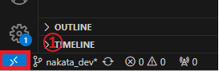
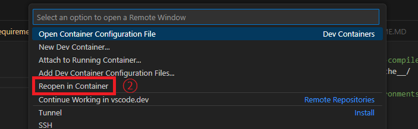

# ChatGPT + Your Data with Azure OpenAI
本講座では、ChatGPTと自分のデータを使ってオリジナルのチャットシステムを作る講座です。

## リスト

- [ChatGPT + Your Data with Azure OpenAI](#chatgpt--your-data-with-azure-openai)
  - [リスト](#リスト)
  - [準備](#準備)
    - [VS Code Install](#vs-code-install)
    - [Docker Install](#docker-install)
    - [Git Install](#git-install)
    - [Github　アカウント作成](#githubアカウント作成)
    - [Azure アカウント作成](#azure-アカウント作成)
    - [Azureの構成](#azureの構成)
    - [OpenAIのキーの発行手順](#openaiのキーの発行手順)
  - [本講座のコード](#本講座のコード)
    - [コードの構成](#コードの構成)
    - [チャットシステムの起動確認](#チャットシステムの起動確認)
    - [ライブラリのインストール](#ライブラリのインストール)
    - [Azure App Serviceに設定する環境変数](#azure-app-serviceに設定する環境変数)
    - [Azure App Serviceのスタートアップコマンド](#azure-app-serviceのスタートアップコマンド)
    - [Azure App Serviceに認証追加後のスタートアップコマンド](#azure-app-serviceに認証追加後のスタートアップコマンド)

## 準備
### VS Code Install
 下記リンクからVSCodeをインストール  
 - https://code.visualstudio.com/download

### Docker Install
 下記リンクからDockerをインストール  
 - Mac：https://docs.docker.com/desktop/install/mac-install/  
 - Windows：https://docs.docker.com/desktop/install/windows-install/
 
 下記リンクからアカウントを作成
 - https://docs.docker.jp/windows/step_five.html

### Git Install
 下記リンクからGitをインストール  
 - Mac：不要インストール済み  
 - Windows：https://gitforwindows.org/

下記のコマンドでインストール確認
```bash
git --version
```

下記コマンドでユーザー設定
```bash
git config --global user.name {user_name}
git config --global user.email {mail_addrress}
```

下記コマンドで登録情報確認できます
```bash
git config --global -l  
```

### Github　アカウント作成
 下記リンクからGithubのアカウントを作成  
 -https://docs.github.com/ja/get-started/start-your-journey/creating-an-account-on-github

### Azure アカウント作成

1. **Microsoftアカウントの作成**:
    - 既にMicrosoftアカウントまたはGitHubアカウントをお持ちの方は、そのアカウントを使ってログインできます。
    - アカウントを持っていない場合は、[Azureのホーム画面](https://azure.microsoft.com)から、Microsoftアカウントを作成できます。

2. **Azure無料アカウントの作成**:
    - [Azureのホーム画面](https://azure.microsoft.com)にアクセスします。
    - 画面右上の「サインイン」をクリックしてサインインします。
    - ログイン後、無料使用版から「開始」をクリックします。
    - 必要な情報（名前、クレジットカード情報など）を入力し、「サインアップ」をクリックします。


### Azureの構成
Azureのサブスクリプションとリソースグループと各サービスの関係


### OpenAIのキーの発行手順
  - [OpenAIログイン](https://platform.openai.com/login/)にアクセスします。
  - プロジェクトを選択します
  - [Dashboardタブ](https://platform.openai.com/assistants)に移動。
  - [API keys](https://platform.openai.com/api-keys)に移動。
  - Create seacret keyを押して作成

## 本講座のコード

### コードの構成

コードの構成は下記になります。

```bash
azure-chat-udemys
  ├── .devcontainer
  │   ├── devcontainer.json           <--- VSCodeでDockerの環境を起動するためのファイル
  ├── .vscode
  │   ├── launch.json                 <--- VSCodeでデバック時の設定ファイル
  ├── app                             <--- ウェブアプリのフォルダ
  │   ├── pages
  │   │   ├── 1_Load_Data_Store.py    <--- PDFデータ読み込みウェブページ
  │   │   ├── 2_Load_Web_Store.py     <--- ウェブデータ読み込みウェブページ
  │   ├── src
  │   │   ├── utils.py                <--- ドキュメント処理関数
  │   ├── app.py                      <--- ウェブアプリのメインファイル
  │   ├── requirements.in             <--- ライブラリのリストを記載
  │   ├── requirements.txt            <--- pip-compile requirements.in で作成
  ├── docs/asset
  ├── notebook
  │   ├── data                        
  │   ├── 1.langchain.ipynb           <--- langchain練習用
  │   ├── 2.embedding.ipynb           <--- ドキュメントの数値化（エンベディング）練習用
  │   ├── 3.vectore_store.ipynb       <--- vector storeの練習用
  │   ├── 4.qa_with_rag.ipynb         <--- 1問1答練習用
  │   └── 5.chat_with_rag.ipynb       <--- チャット練習用
  ├── .env                            <--- 環境変数設定ファイル　＊.env-sampleから作成
  ├── .env-sample                     <--- 環境変数設定ファイルのサンプル
  ├── .gitignore
  ├── Dockerfile                      <--- Dockerファイル
  ├── README.MD
  ├── requirements-dev.txt            <--- 開発時のライブラリリスト
  └── requirements.txt                <--- Azure実装時のライブラリリスト＊appフォルダ内のものと同じ
```

### チャットシステムの起動確認
以下の手順でチャットが起動できるかご確認ください。 
コースでも紹介しますが、エラーなどはQAで問い合わせください。

1. DockerDesktopを起動
2. VSCodeで本コースでダウンロードしたフォルダを開く
3. 下記を画像の個所を押してVSCodeのDevcontainerを開く＊数十分かかります




4. run and debugでPython：appを選択
5. F5を押してウェブアプリを起動　＊.vscodeフォルダ内の設定で起動します
6. ブラウザで[http://localhost:8501/](http://localhost:8501/)を開く

### ライブラリのインストール
1. pip-toolsのインストール
```bash
pip install pip-tools
```
2. requirements.txtの作成
```bash
pip-compile app/requirements.in
```
3. ライブラリインストール
```bash
pip install -r requirements-dev.txt
```

### Azure App Serviceに設定する環境変数
https://learn.microsoft.com/ja-jp/azure/app-service/reference-app-settings?tabs=kudu%2Cdotnet
 - SCM_DO_BUILD_DURING_DEPLOYMENT : 1
 - WEBSITES_PORT：8000
 - AZURE_OPENAI_API_KEY : 各自の値
 - AZURE_OPENAI_ENDPOINT : 各自の値
 - OPENAI_API_KEY : 各自の値

### Azure App Serviceのスタートアップコマンド
python -m streamlit run app/app.py --server.port 8000 --server.address 0.0.0.0

### Azure App Serviceに認証追加後のスタートアップコマンド
認証を入れると、ファイルをUploadする際エラーが発生するようになります。  
対策として次のスタートアップコマンドに変更します。  
XSRFをFalseとします。
<a href="https://docs.streamlit.io/knowledge-base/deploy/remote-start"> 参考ドキュメント</a>  

```
python -m streamlit run app/app.py --server.port 8000 --server.address 0.0.0.0 --server.enableXsrfProtection=false
```